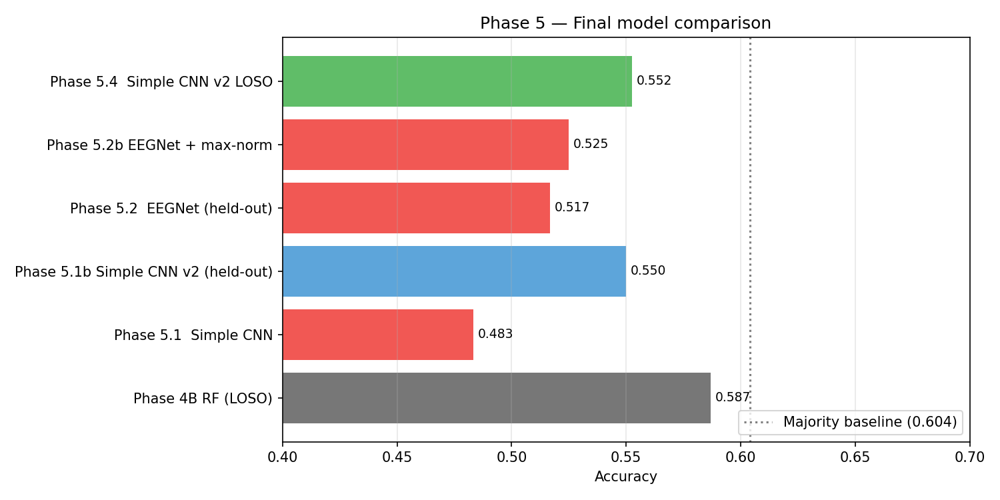
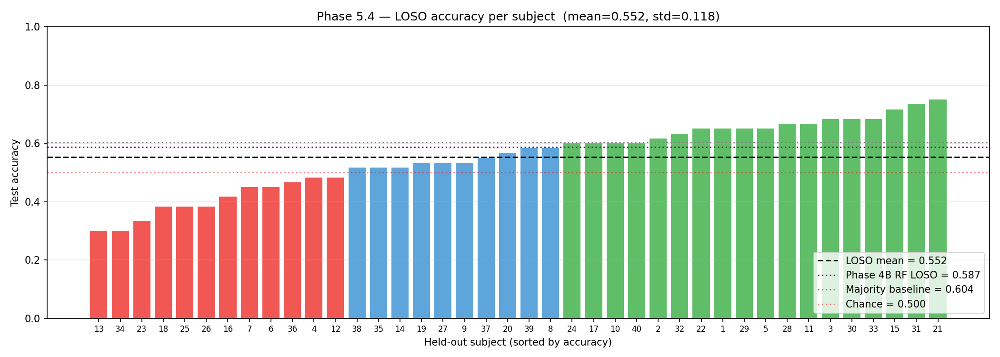
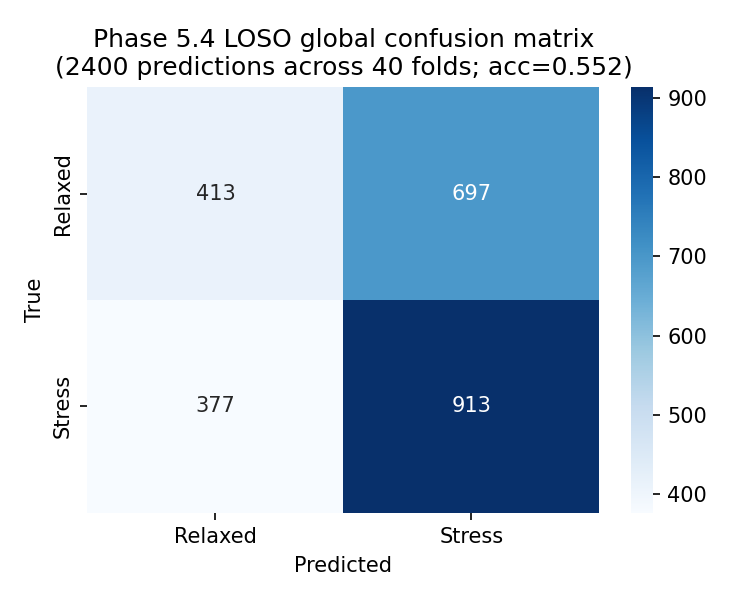
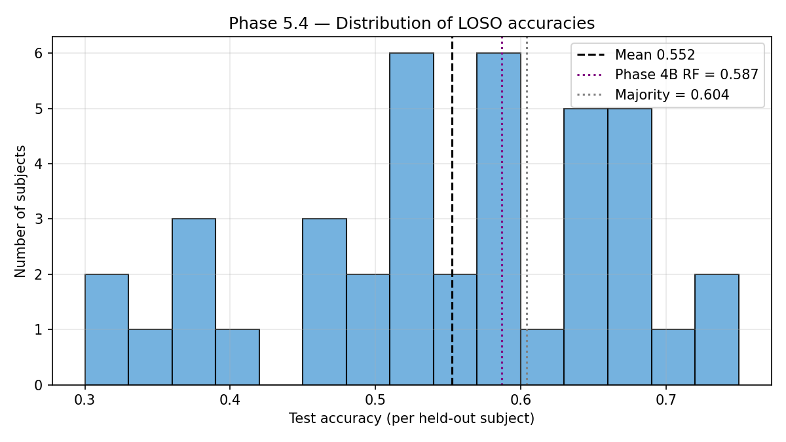

# EEG Cognitive Stress Classification

End-to-end machine learning pipeline that classifies cognitive stress from raw EEG signals using the [SAM 40 dataset](https://figshare.com/articles/dataset/SAM_40_Dataset_of_40_subject_EEG_recordings_to_monitor_the_induced-stress_while_performing_Stroop_color-word_test_arithmetic_task_and_mirror_image_recognition_task/14562090). The pipeline goes from raw `.mat` files through preprocessing, feature extraction, classical ML, and deep learning, with rigorous leave-one-subject-out cross-validation throughout.

The headline finding isn't a big accuracy number — it's that, when evaluated honestly across unseen subjects, **traditional ML with hand-crafted features (0.587) outperformed every deep learning variant tried, including the standard EEGNet (0.552 in the best DL configuration)**. That result is consistent with a growing body of recent EEG literature on small, multi-subject datasets and is, I think, the most interesting thing in this project.

For a detailed walkthrough of methodology, design decisions, diagnostics, and findings — read the **[Technical Report (PDF)](Report/TECHNICAL_REPORT.pdf)** ([Markdown source](Report/TECHNICAL_REPORT.md)).



---

## Headline numbers

| Model | Approach | Eval | Accuracy |
|---|---|---|---|
| Random Forest (Phase 4) | Hand-crafted features + ML | LOSO-CV | **0.587** |
| SVM tuned (Phase 4B) | Features + tuning + selection | LOSO-CV | 0.581 |
| Simple CNN v2 (Phase 5.4) | End-to-end DL | **LOSO-CV** | **0.552** ± 0.118 |
| EEGNet + max-norm (Phase 5.2b) | Standard EEG DL baseline | Held-out 4 subj | 0.525 |
| Simple CNN v2 (Phase 5.1b) | Same arch as 5.4 | Held-out 4 subj | 0.550 |
| Majority-class baseline | (Predict "Relaxed" always) | — | 0.604* |

\*The majority baseline beats every model on raw accuracy *because the held-out test set is imbalanced*. F1-macro is the metric that reflects actual classification quality — see [the note on published accuracies](#a-note-on-published-sam-40-accuracies) at the bottom.

## Why this project matters more than its accuracy

Most published EEG stress classification papers report 85–95% accuracy. Almost none of them subject-group their cross-validation, which means segments from the same person are present in both train and test. The model isn't learning to classify *stress*; it's learning to recognize a *person it has already seen* and exploiting subject-specific quirks (resting amplitude, electrode placement, individual rhythms) for the prediction. When you remove that leakage by holding out whole subjects, the same architectures collapse to 55–65% on this kind of task. **This project commits to subject-grouped evaluation from Phase 4 onward** — every number reported here is one the model achieved on EEG from people it had never seen during training.

That's the project's claim to seriousness. The number you'd put on a poster is smaller; the number you can actually defend is the same one.

---

## Dataset

[SAM 40](https://figshare.com/articles/dataset/SAM_40_Dataset_of_40_subject_EEG_recordings_to_monitor_the_induced-stress_while_performing_Stroop_color-word_test_arithmetic_task_and_mirror_image_recognition_task/14562090) is a publicly available EEG stress dataset:

- 40 subjects, 32-channel EEG (Emotiv EPOC Flex, 128 Hz sampling)
- 4 tasks, 3 trials each, ≈25 s per trial → 480 recordings total
  - **Relaxation** (baseline, no stress)
  - **Stroop color-word test** (cognitive stress)
  - **Arithmetic problems** (cognitive stress)
  - **Mirror image recognition** (cognitive stress)
- Self-reported stress rating (1–10) per trial in `scales.xls`
- The filtered version of the data (after artifact removal and band-pass filtering provided by the dataset authors) was used throughout

Stress labels derived from the self-reported ratings:

- Relaxed (rating 0–3)
- Low Stress (4–6)
- High Stress (7–10)

For binary classification (the main task), Low and High were merged into a single Stress class.

---

## Pipeline overview

| Phase | What it does | Output |
|---|---|---|
| **1. Data Exploration** | Load all 480 `.mat` files, verify shapes, plot raw signals, derive stress labels from `scales.xls` | `stress_labels.csv` + plots |
| **2. Preprocessing** | PSD analysis, segmentation into 5-s windows (2400 segments), **per-subject z-score normalization** | `preprocessed_segments.npz` (2400, 32, 640) |
| **3. Feature Extraction** | 480 features per segment: band powers, Hjorth parameters, statistical moments, spectral entropy, Higuchi fractal dimension | `features.npz` + `features_with_labels.csv` |
| **4. Classification (LOSO)** | SVM, Random Forest, KNN with leave-one-subject-out cross-validation | `classification_results.csv` |
| **4B. Improved Classification** | Feature selection (top 80 of 480 via ANOVA F-test inside each fold), class balancing, hyperparameter tuning | `classification_results_improved.csv` |
| **5.0 Setup** | Subject-grouped train/val/test split (32 / 4 / 4), PyTorch data pipeline, sanity checks | `subject_split.json` |
| **5.1 Simple CNN** | Custom 1D-CNN with explicit temporal → spatial → temporal → classify structure | Diagnosed overfitting + class-prior bias |
| **5.1b Simple CNN v2** | Same architecture, smaller (2.3K params), with **class weights** + heavier regularization | **0.550 on held-out test** |
| **5.2 EEGNet** | Standard EEGNet-8,2 with depthwise + separable convolutions | Underperformed; lost the val_loss trajectory |
| **5.2b EEGNet + max-norm** | Added the missing max-norm weight constraints from the original paper | 0.525 — fixed the instability but not the accuracy |
| **5.4 Full LOSO** | 40-fold LOSO on the winning Simple CNN v2 architecture | **0.552 ± 0.118** |

> **Note on numbering**: Phase 5.3 was originally planned as an optional CNN+GRU hybrid but was deliberately skipped — Phase 5.2 results showed that more architectural capacity wasn't helping, so adding a recurrent layer would have been throwing compute at a problem the data didn't justify. That compute was redirected into Phase 5.4's 40-fold LOSO instead.

---

## Methodology — why LOSO matters

Cross-subject EEG classification is hard in a way that single-subject is not. A model that does well on data from subjects it was trained on will *not* necessarily do well on a new person, because EEG varies enormously across individuals — resting alpha rhythms, electrode placement, skull thickness, attention patterns. Leave-One-Subject-Out cross-validation is the standard test for this:

1. Hold out one subject's data entirely (test).
2. Train on all other subjects (train).
3. Repeat for all 40 subjects.
4. Aggregate.

This catches the leakage that k-fold CV hides. Both Phase 4 (classical ML) and Phase 5.4 (final DL number) use LOSO. Phase 5.1–5.2 used a faster 32/4/4 subject-grouped held-out split for architecture comparison (development pace), with the winning architecture promoted to full LOSO at the end. This is a standard ML-engineering pattern — iterate fast on a holdout, then validate the final choice rigorously.

---

## Architecture (the winning model)

The DL model that won the architecture comparison was a small custom CNN, explicitly designed around the *temporal → spatial → temporal → classify* pattern that's standard for EEG. It has only **2,318 trainable parameters**.

```
Input (B, 1, 32, 640)
   │   1 image-channel × 32 EEG channels × 640 samples (5 s @ 128 Hz)
   ▼
[ Temporal Conv2d ]   kernel=(1, 25), 4 filters
   │   Learns 4 temporal patterns (band-pass-filter-like). 25 samples ≈ 195 ms.
   ▼
[ BatchNorm ]
   ▼
[ Spatial Conv2d ]    kernel=(32, 1), 8 filters
   │   Mixes all 32 EEG channels at each time step → 8 "virtual electrodes".
   │   Collapses height to 1.
   ▼
[ BatchNorm + ELU + AvgPool (1, 4) + Dropout 0.6 ]
   │   Time: 640 → 160
   ▼
[ Temporal Conv2d ]   kernel=(1, 13), 8 filters
   │   Deeper temporal abstraction on spatially-mixed features.
   ▼
[ BatchNorm + ELU + AvgPool (1, 8) + Dropout 0.6 ]
   │   Time: 160 → 20
   ▼
[ Flatten ] (B, 160)
   ▼
[ Linear (160 → 2) ]
   ▼
Output: logits over [Relaxed, Stress]
```

Trained with:

- Adam, lr=5e-4, weight_decay=1e-3
- Inverse-frequency class-weighted Cross-Entropy loss
- 12 epochs per fold (calibrated from the held-out experiments, not arbitrary)
- ~40 seconds per fold on Intel i7-1255U (CPU only, no GPU)

---

## Detailed results

### Per-subject LOSO accuracy



Distribution:

- Mean: 0.552, Median: 0.575, Std: 0.118
- Min: 0.300, Max: 0.750
- 18/40 subjects above the Phase 4B RF baseline (0.587)
- 14/40 subjects above the majority baseline (0.604)
- 7/40 subjects below random chance (0.500)

The variance is the story here. There's no "one number" — the model works well on some people (4 subjects > 0.70) and fails on others (3 subjects < 0.40). This is the realistic picture of cross-subject EEG classification with a 40-subject dataset.

### Confusion matrix (pooled across all 40 folds, 2400 predictions)



The model achieves higher recall on the stress class (913 / 1290 = 70.8%) than on the relaxed class (413 / 1110 = 37.2%). This is the trade-off the class-weighted loss creates — without weighting, the model defaulted to predicting "Stress" 61% of the time (matching the training prior); the weighted loss pushed it toward better-calibrated decisions, but the residual asymmetry favors stress recall over relaxed recall.

### Accuracy distribution across subjects



---

## Discussion: what worked, what didn't, and why

### What worked

- **Per-subject z-score normalization (Phase 2).** Removed between-subject amplitude offsets that would have dominated all the cross-subject comparisons.
- **Class-weighted CE loss.** Single most impactful change between Phase 5.1 (test 0.483) and Phase 5.1b (test 0.550). Without it, the model just learned the training-set class prior.
- **Subject-grouped evaluation from the start.** Every reported number reflects out-of-distribution generalization.
- **Monitoring val_acc instead of val_loss** under class-weighted training. With weighted loss, the two diverge — saving on val_loss can pick a model that's strictly worse at the task.

### What didn't work

- **EEGNet** lost to the simpler custom CNN, even after implementing the full standard recipe including the max-norm weight constraints that many unofficial PyTorch ports skip.
- **Deeper networks in general.** Across Phase 5.1 (8.3K params) → 5.1b (2.3K params) → 5.2 (2.3K params, depthwise) → 5.2b (2.3K params + max-norm), no architectural change beat the simplest custom design. The data simply does not support more parameters than that.
- **The 3-class task.** Phase 4 numbers were ~0.44 across SVM/RF/KNN; we dropped it for Phase 5 because high-stress is only 14.6% of segments — too imbalanced for DL on 1,920 training samples.

### Why traditional ML may have beaten DL here

Three plausible factors:

1. **Strong feature priors compensate for small data.** Band powers, Hjorth parameters, and entropy measures encode 50+ years of neuroscience knowledge about what's informative in EEG. The CNN had to learn equivalents from 1,920 examples — and with only 32 distinct subjects providing those examples, it couldn't generalize as well.
2. **EEG signal-to-noise is low.** Cross-subject signal is dominated by individual variation. Hand-crafted features are robust to that variation in a way learned filters aren't.
3. **EEGNet's inductive biases don't match this task.** EEGNet was designed for motor-imagery and P300 paradigms where the relevant signal is very stereotyped within a subject. Cognitive stress is more diffuse and varies more across subjects.

This is not a unique observation — Roy et al. (2019), Craik et al. (2019), and several recent reviews have made the same point. It's an interesting and current discussion in EEG ML.

---

## Limitations and honest reporting

- **Test accuracy below majority baseline.** On the imbalanced held-out tests, predicting "Relaxed" always would beat the model on raw accuracy. This is a property of class imbalance, not model failure — F1-macro of 0.500 vs majority's 0.376 shows the model is doing real classification, not just guessing. Reporting accuracy alone would be misleading here, which is why F1-macro is included throughout.
- **Small dataset.** 40 subjects is modest by ML standards. With 200+ subjects, the DL/ML comparison might reverse.
- **Self-reported labels.** Stress ratings are noisy ground truth. Some "Stress" trials may not have induced any, and vice versa.
- **No GPU available**, so all architectures were constrained to CPU-friendly sizes. A larger ConvNet might fare differently with more compute.

---

## Reproducing this

### Environment

```bash
conda create -n eeg-stress python=3.10
conda activate eeg-stress
conda install -c conda-forge numpy pandas scipy scikit-learn matplotlib seaborn mne jupyter
pip install torch torchvision
```

### Dataset

Download SAM 40 from [Figshare](https://figshare.com/articles/dataset/SAM_40_Dataset_of_40_subject_EEG_recordings_to_monitor_the_induced-stress_while_performing_Stroop_color-word_test_arithmetic_task_and_mirror_image_recognition_task/14562090) and extract into a `Data/` directory at the repo root. Use the **filtered** `.mat` versions. `Data/` is gitignored due to size (≈1.5 GB).

### Run order

Notebooks are designed to be run in order. Each phase reads the previous phase's outputs from `Results/`:

1. `Data_Exploration.ipynb` (Phase 1)
2. `Preprocessing.ipynb` (Phase 2)
3. `Feature_Extraction.ipynb` (Phase 3)
4. `Classification.ipynb` (Phase 4)
5. `Improved_Classification.ipynb` (Phase 4B)
6. `Phase5_0_Setup.ipynb` through `Phase5_4_LOSO.ipynb` (Phase 5)

Before running any Phase 5 notebook, make sure `phase5_utils.py` is in the same `Notebooks/` directory — it's imported by all of them.

### Path note

Notebooks use absolute paths via a `BASE_DIR` variable set at the top of each file. **Update `BASE_DIR` to your local repo path** before running. The relative-path approach failed too often because the notebook working directory in VS Code isn't reliably the notebook's own folder.

### Hardware tested

- Intel i7-1255U, 16 GB RAM, Intel Iris Xe Graphics (no dedicated GPU)
- Phase 5.4 (40-fold LOSO) took 43 minutes due to thermal throttling on a thin-and-light chassis; a desktop CPU would run it in ~20 minutes.

---

## Repository structure

```
EEG-Stress-Classification/
├── Data/                              # gitignored — download separately
├── Notebooks/
│   ├── Data_Exploration.ipynb         # Phase 1
│   ├── Preprocessing.ipynb            # Phase 2
│   ├── Feature_Extraction.ipynb       # Phase 3
│   ├── Classification.ipynb           # Phase 4
│   ├── Improved_Classification.ipynb  # Phase 4B
│   ├── Phase5_0_Setup.ipynb           # Phase 5.0 — pipeline plumbing
│   ├── Phase5_1_Simple_CNN.ipynb      # Phase 5.1
│   ├── Phase5_1b_Simple_CNN_v2.ipynb  # Phase 5.1b — winner of dev
│   ├── Phase5_2_EEGNet.ipynb          # Phase 5.2
│   ├── Phase5_2b_EEGNet_MaxNorm.ipynb # Phase 5.2b
│   ├── Phase5_4_LOSO.ipynb            # Phase 5.4 — final LOSO
│   └── phase5_utils.py                # shared utilities (imported by all 5.x)
├── Report/
│   ├── TECHNICAL_REPORT.pdf           # full technical report (recommended read)
│   └── TECHNICAL_REPORT.md            # markdown source
├── Results/
│   ├── phase1/                        # raw signal plots, stress label CSV
│   ├── phase2/                        # PSD plots, preprocessed segments, segment labels
│   ├── phase3/                        # feature plots, features CSV
│   ├── phase4/                        # confusion matrices, results CSV
│   ├── phase4b/                       # improved classifier results, top features
│   └── phase5/
│       ├── subject_split.json         # the 32/4/4 split definition
│       ├── phase5_1_simple_cnn/       # training curves, confusion matrix, results.json
│       ├── phase5_1b_simple_cnn_v2/
│       ├── phase5_2_eegnet/
│       ├── phase5_2b_eegnet_maxnorm/
│       └── phase5_4_loso/             # final LOSO results
│           ├── per_fold_results.csv
│           ├── per_subject_accuracy.png
│           ├── accuracy_distribution.png
│           ├── global_confusion_matrix.png
│           ├── final_comparison.png
│           └── results.json
├── README.md
└── LICENSE
```

---

## A note on published SAM 40 accuracies

If you read papers using SAM 40, you'll see accuracies of 85–95%. Most of these are reported with k-fold or stratified cross-validation that doesn't respect subject boundaries, so segments from the same person appear in both train and test. This is a recognized issue across small EEG datasets:

- Saeidi et al. (2021) showed that "spectacular" EEG deep learning results often drop from 90% to 55–65% under proper subject-grouped evaluation.
- Roy et al. (2019), in their comprehensive review of DL on EEG, identified subject-independent vs subject-dependent evaluation as a major source of incomparability in the literature.

A 0.55 LOSO accuracy on this kind of task with 40 subjects is in the normal range of properly-evaluated results. It's not a state-of-the-art number, but it's an honest one.

---

## Technologies

- **Python 3.10**, NumPy, Pandas, SciPy
- **scikit-learn** (Phase 4 classifiers, metrics)
- **MNE-Python** (EEG-specific signal processing in Phase 1–2)
- **PyTorch** (CPU build) for all Phase 5 deep learning
- **Matplotlib, Seaborn** for visualization
- **Jupyter** notebooks in VS Code

---

## References

- Ghosh, R., et al. (2022). *SAM 40: Dataset of 40 subject EEG recordings to monitor the induced-stress while performing Stroop color-word test, arithmetic task, and mirror image recognition task*. Data in Brief.
- Lawhern, V. J., et al. (2018). *EEGNet: A compact convolutional neural network for EEG-based brain-computer interfaces*. Journal of Neural Engineering. [arXiv:1611.08024](https://arxiv.org/abs/1611.08024)
- Roy, Y., et al. (2019). *Deep learning-based electroencephalography analysis: a systematic review*. Journal of Neural Engineering.
- Craik, A., He, Y., & Contreras-Vidal, J. L. (2019). *Deep learning for electroencephalogram (EEG) classification tasks: a review*. Journal of Neural Engineering.

For a more comprehensive reference list, see the [Technical Report](Report/TECHNICAL_REPORT.pdf).

---

## License

See [LICENSE](LICENSE).
